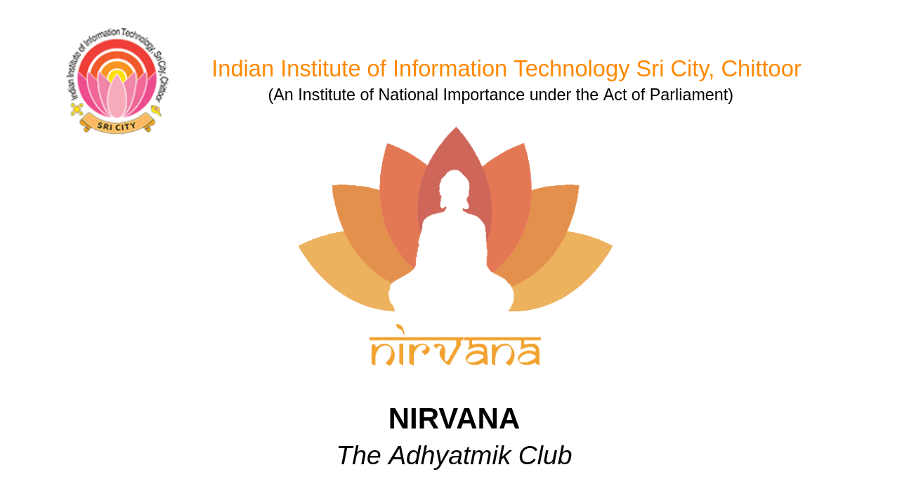

# NIRVANA

## The Adhyatmik Club

- **Faculty Mentor**: *Dr. Piyush Joshi*
- **Club Head**: *Raghavendra CVS*
- **Asst Club Heads**: *Himanshu Saraswat and Aahnik Daw*

## Objectives

- Use meditation, yoga, and adhyatmika to
  - live a stress-free life.
  - achieve material success.
  - and finally, seek beyond.
- Explore traditional Indian Knowledge Systems and their relationship with modern science.

## Events

### Yoga & Meditation Sessions (Yog)

- Biweekly or monthly sessions.
- Relaxation and stress relief through yoga and meditation
- Conduct music listening and meditation sessions

### Lecture Sessions by Guests (Upadesh)

- Bimonthly lecture sessions.
- Invite contemporary spiritual and thought leaders to deliver talks and interact with us.

### Reading and Discussion Sessions (Shastrartha)

- Understanding our itihasa like Ramayana and Mahabharata
- Puranas like Bhagavatam
Eternal teachings like Bhagavad Gita
- Contemporary works like AI and Power (Rajiv Malhotra), Indistractible(Nir Eyal), Deep Work(Cal Newport), Sapiens, Homo Deus, and 21 Lessons for 21st Century (Yuval Noah Harari), and more.
- Reading research papers on neuroscience, meditation, and other fields that relate to the human mind, consciousness, and psychology.

## Inspiration

We were deeply inspired by spiritual and nationalistic clubs of various reputed institutions such as:

- IIT Bombay Yogastha
- IIT Kanpur Vivekananda Samiti
- IIT Madras Vande Mataram
- Bits Pilani Sovesa
- IIT Kanpur & IIT Patna Bhaktivedanta Club

## Collaboration

- We look forward to collaborating with various organizations of National Importance such as

  - Infinity Foundation
  - Isha Foundation
  - Ramakrishna Mission and Vedanta Society New York
  - Art of Living Foundation
  - ISKCON
  - Patanjali Yog Peeth
  - and more

- We would like to invite guests from these organizations to deliver talks to spread their ideas and   conduct hands-on workshops.
- Work closely with SLCs and provide adhyatmik support for various Pujas and festivals celebrated throughout the year.
- Collaborate with technical clubs of our college for the development of apps, APIs, and websites that promote yoga, meditation, and knowledge of shastras.
- Work with cultural clubs to celebrate Indian traditional music and dance that is deeply intertwined with adhyatmika during various festivals.

## Future Vision

- Pan IIIT Collaboration:
  - Do joint sessions with similar clubs of other IIITs.
  - Inspire other colleges to form similar clubs and help them start.
- Meditation Room:
  - a silent room with a proper ambiance to meditate.
  - can be used as a community room during Festivals.

## Special Advisors

- Shri Ramakrishna Rath

## Core Members (2023-2024)

- Shashwat Gupta
- Divyanshu Jha
- Biswajit Maitra
- Priyansh Singhal
- Kaushik Ponnapali

